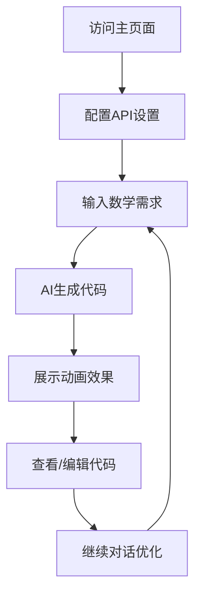

# SimpleMath - 数学算法可视化演示平台

## 1. Product Overview
基于Vue和p5.js构建的交互式数学算法可视化演示平台，类似3Blue1Brown的Manim项目的Web版本。用户通过AI对话输入需求，系统自动生成p5.js代码并实时展示数学概念和算法的动画效果。
- 解决数学教学和算法理解的可视化需求，让复杂的数学概念通过动画变得直观易懂
- 面向数学教师、学生、算法爱好者和开发者，提供零代码的数学动画创建体验
- 目标成为Web端最易用的数学可视化工具，降低数学动画制作门槛

## 2. Core Features

### 2.1 User Roles
本产品无需用户注册登录，所有功能对访客开放。

### 2.2 Feature Module
我们的数学可视化平台包含以下核心页面：
1. **主页面**：AI对话区域、p5.js动画展示区域、设置面板

### 2.3 Page Details

| Page Name | Module Name | Feature description |
|-----------|-------------|---------------------|
| 主页面 | AI对话区域 | 输入数学概念或算法需求，发送消息，查看AI回复，显示对话历史 |
| 主页面 | p5.js动画展示区域 | 实时渲染p5.js动画，全屏显示，播放控制（播放/暂停/重置） |
| 主页面 | 设置面板 | 选择OpenAI模型（GPT-3.5/GPT-4），调整模型参数（温度、最大tokens），配置API密钥 |
| 主页面 | 代码编辑器 | 显示生成的p5.js代码，支持手动编辑，实时预览代码变更 |

## 3. Core Process

用户操作流程：
1. 用户访问主页面，看到左右分栏布局
2. 在设置面板中配置OpenAI API密钥和模型参数
3. 在左侧AI对话框中输入数学概念或算法需求（如"展示傅里叶变换"、"可视化冒泡排序算法"）
4. 系统调用OpenAI API生成对应的p5.js代码
5. 右侧动画区域自动加载并运行生成的代码，展示数学动画
6. 用户可以查看生成的代码，进行手动调整
7. 用户可以继续对话，优化或修改动画效果

## 4. User Interface Design

### 4.1 Design Style
- 主色调：深蓝色(#1e3a8a)和白色(#ffffff)，辅助色：浅灰色(#f8fafc)和绿色(#10b981)
- 按钮样式：圆角矩形，悬停时有阴影效果
- 字体：系统默认字体，标题16px，正文14px，代码12px等宽字体
- 布局风格：左右分栏卡片式布局，顶部导航栏
- 图标风格：简洁的线性图标，支持数学符号和播放控制图标

### 4.2 Page Design Overview

| Page Name | Module Name | UI Elements |
|-----------|-------------|-------------|
| 主页面 | 顶部导航栏 | 项目标题、设置按钮、GitHub链接，背景色#1e3a8a，白色文字 |
| 主页面 | AI对话区域 | 消息列表、输入框、发送按钮，卡片式设计，滚动条，占左侧40%宽度 |
| 主页面 | p5.js展示区域 | 画布容器、播放控制按钮、全屏按钮，黑色背景，占右侧60%宽度 |
| 主页面 | 设置面板 | 模态框形式，包含API配置、模型选择、参数滑块，白色背景 |
| 主页面 | 代码编辑器 | 可折叠面板，语法高亮，行号显示，位于动画区域下方 |

### 4.3 Responsiveness
桌面优先设计，支持平板适配。在小屏幕设备上，左右分栏改为上下布局，对话区域在上，动画区域在下。支持触摸操作优化。