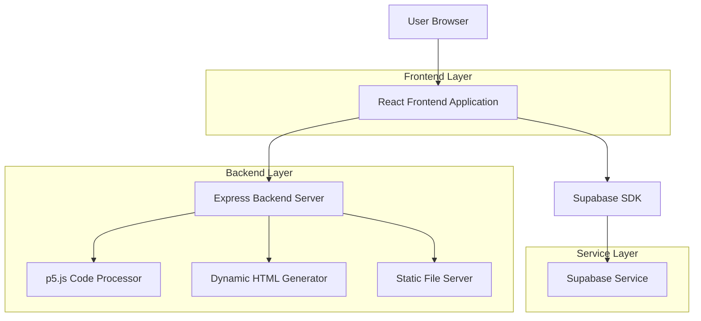
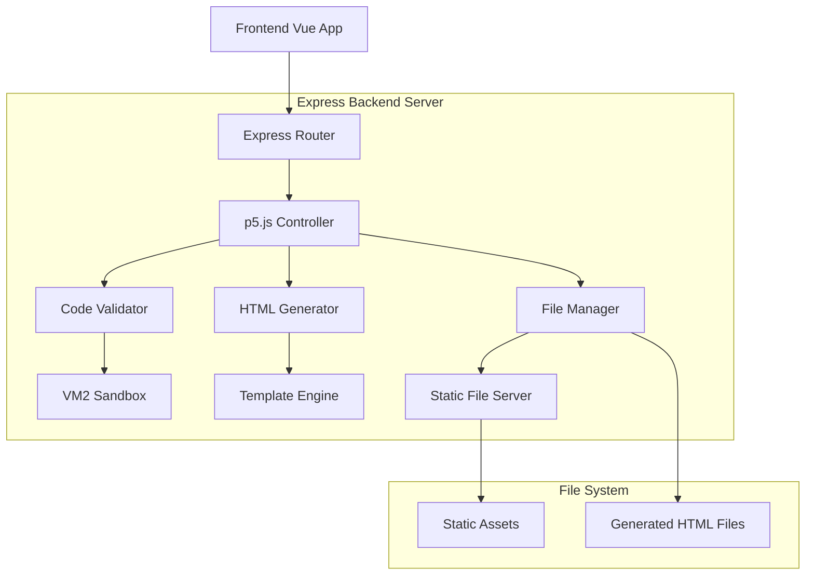
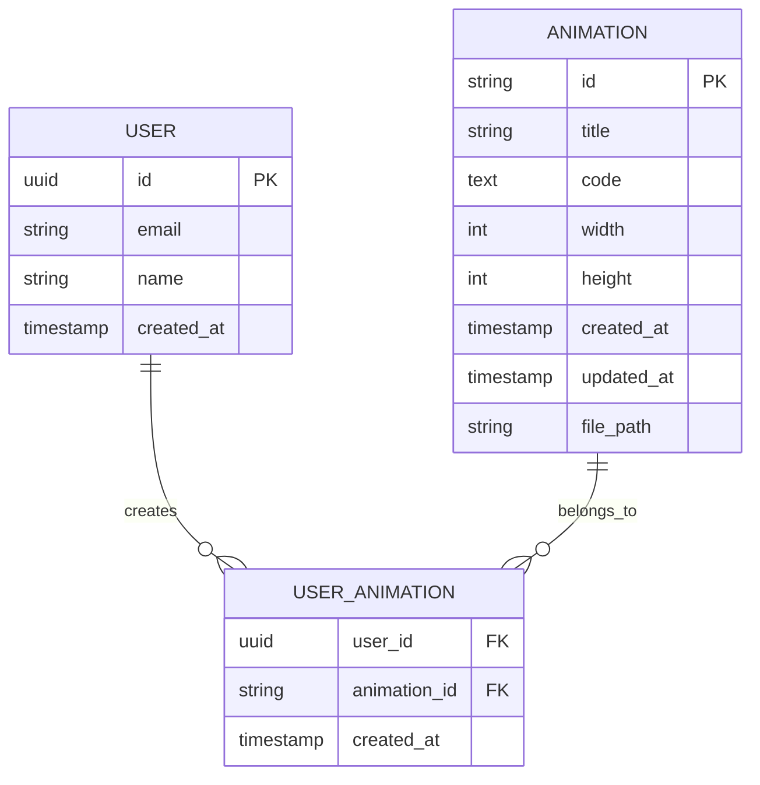

# SimpleMath - 技术架构文档

## 1. Architecture design



## 2. Technology Description

- Frontend: Vue@3 + TypeScript + Vite + TailwindCSS + Pinia
- Backend: Express@4 + TypeScript + CORS
- Database: Supabase (PostgreSQL)
- Code Processing: p5.js + VM2 (安全沙箱)
- File Serving: Express Static + UUID

## 3. Route definitions

### 3.1 Frontend Routes

| Route | Purpose |
|-------|----------|
| / | 主页，展示数学动画生成界面 |
| /settings | 设置页面，配置OpenAI API等参数 |

### 3.2 Backend Routes

| Route | Method | Purpose |
|-------|--------|----------|
| /api/p5/create | POST | 创建新的p5.js动画页面 |
| /api/p5/:id | GET | 获取指定动画的信息 |
| /api/p5/:id | DELETE | 删除指定的动画 |
| /animation/:id | GET | 访问生成的动画HTML页面 |
| /static/* | GET | 静态资源服务 |

## 4. API definitions

### 4.1 p5.js代码处理API

**创建动画页面**
```
POST /api/p5/create
```

Request:
| Param Name | Param Type | isRequired | Description |
|------------|------------|------------|-------------|
| code       | string     | true       | p5.js代码内容 |
| title      | string     | false      | 动画标题 |
| width      | number     | false      | 画布宽度，默认400 |
| height     | number     | false      | 画布高度，默认400 |

Response:
| Param Name | Param Type | Description |
|------------|------------|-------------|
| success    | boolean    | 请求是否成功 |
| url        | string     | 动画页面URL |
| id         | string     | 动画唯一标识 |
| error      | string     | 错误信息（如果有） |

Example Request:
```json
{
  "code": "function setup() { createCanvas(400, 400); } function draw() { background(220); circle(200, 200, 50); }",
  "title": "简单圆形动画",
  "width": 400,
  "height": 400
}
```

Example Response:
```json
{
  "success": true,
  "url": "http://localhost:3001/animation/abc123-def456-ghi789",
  "id": "abc123-def456-ghi789"
}
```

**获取动画信息**
```
GET /api/p5/:id
```

Response:
| Param Name | Param Type | Description |
|------------|------------|-------------|
| success    | boolean    | 请求是否成功 |
| code       | string     | p5.js代码内容 |
| title      | string     | 动画标题 |
| createdAt  | string     | 创建时间 |

**删除动画**
```
DELETE /api/p5/:id
```

Response:
| Param Name | Param Type | Description |
|------------|------------|-------------|
| success    | boolean    | 删除是否成功 |
| message    | string     | 操作结果信息 |

## 5. Server architecture diagram



### 5.1 核心工作流程

1. **代码接收**: Frontend发送p5.js代码到Express后端
2. **安全验证**: 使用VM2沙箱验证代码安全性
3. **HTML生成**: 基于模板生成包含p5.js代码的完整HTML页面
4. **文件存储**: 将生成的HTML文件保存到文件系统
5. **URL返回**: 返回可访问的动画页面URL
6. **iframe展示**: Frontend使用iframe加载返回的URL

## 6. Data model

### 6.1 Data model definition



### 6.2 Data Definition Language

**Animation Table (animations)**
```sql
-- 创建动画表
CREATE TABLE animations (
    id VARCHAR(36) PRIMARY KEY, -- UUID格式
    title VARCHAR(255),
    code TEXT NOT NULL,
    width INTEGER DEFAULT 400,
    height INTEGER DEFAULT 400,
    created_at TIMESTAMP WITH TIME ZONE DEFAULT NOW(),
    updated_at TIMESTAMP WITH TIME ZONE DEFAULT NOW(),
    file_path VARCHAR(500) -- 生成的HTML文件路径
);

-- 创建索引
CREATE INDEX idx_animations_created_at ON animations(created_at DESC);
CREATE INDEX idx_animations_title ON animations(title);
```

**User Table (users)**
```sql
-- 创建用户表
CREATE TABLE users (
    id UUID PRIMARY KEY DEFAULT gen_random_uuid(),
    email VARCHAR(255) UNIQUE NOT NULL,
    name VARCHAR(100) NOT NULL,
    created_at TIMESTAMP WITH TIME ZONE DEFAULT NOW()
);

-- 创建索引
CREATE INDEX idx_users_email ON users(email);
```

**User Animation Relation Table (user_animations)**
```sql
-- 创建用户动画关联表
CREATE TABLE user_animations (
    user_id UUID REFERENCES users(id) ON DELETE CASCADE,
    animation_id VARCHAR(36) REFERENCES animations(id) ON DELETE CASCADE,
    created_at TIMESTAMP WITH TIME ZONE DEFAULT NOW(),
    PRIMARY KEY (user_id, animation_id)
);

-- 创建索引
CREATE INDEX idx_user_animations_user_id ON user_animations(user_id);
CREATE INDEX idx_user_animations_animation_id ON user_animations(animation_id);
```

**权限设置**
```sql
-- 为匿名用户授予基本读取权限
GRANT SELECT ON animations TO anon;
GRANT SELECT ON users TO anon;
GRANT SELECT ON user_animations TO anon;

-- 为认证用户授予完整权限
GRANT ALL PRIVILEGES ON animations TO authenticated;
GRANT ALL PRIVILEGES ON users TO authenticated;
GRANT ALL PRIVILEGES ON user_animations TO authenticated;
```

## 6. 核心组件架构

### 6.1 Vue 组件结构

```
App.vue
├── HeaderNav.vue (顶部导航)
├── ChatPanel.vue (左侧对话面板)
│   ├── MessageList.vue (消息列表)
│   ├── MessageInput.vue (输入框)
│   └── TypingIndicator.vue (输入状态)
├── AnimationPanel.vue (右侧动画面板)
│   ├── P5Canvas.vue (p5.js画布)
│   ├── PlayControls.vue (播放控制)
│   └── CodeEditor.vue (代码编辑器)
└── SettingsModal.vue (设置弹窗)
    ├── ApiConfig.vue (API配置)
    └── ModelParams.vue (模型参数)
```

### 6.2 状态管理

使用 Pinia 进行状态管理：

```typescript
// stores/conversation.ts
export const useConversationStore = defineStore('conversation', {
  state: () => ({
    currentConversation: null as Conversation | null,
    conversations: [] as Conversation[],
    isLoading: false
  })
});

// stores/settings.ts
export const useSettingsStore = defineStore('settings', {
  state: () => ({
    apiKey: '',
    model: 'gpt-3.5-turbo',
    temperature: 0.7,
    maxTokens: 2000
  })
});

// stores/p5.ts
export const useP5Store = defineStore('p5', {
  state: () => ({
    currentCode: '',
    isRunning: false,
    instance: null as any
  })
});
```

### 6.3 p5.js 集成方案

使用 p5.js 的实例模式，避免全局污染：

```typescript
// composables/useP5.ts
export function useP5() {
  const p5Store = useP5Store();
  let p5Instance: any = null;
  
  const runCode = (code: string) => {
    // 清理旧实例
    if (p5Instance) {
      p5Instance.remove();
    }
    
    // 创建新的p5实例
    const sketch = new Function('p', code);
    p5Instance = new p5(sketch, 'p5-container');
    
    p5Store.instance = p5Instance;
    p5Store.isRunning = true;
  };
  
  const stopAnimation = () => {
    if (p5Instance) {
      p5Instance.noLoop();
      p5Store.isRunning = false;
    }
  };
  
  return { runCode, stopAnimation };
}
```

